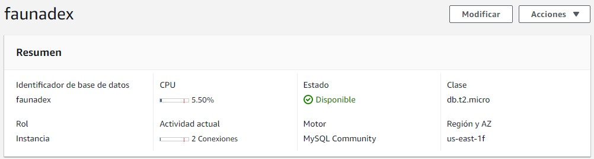

# **SEMINARIO DE SISTEMAS 1 GRUPO2**

Documentación para la Práctica 2 del curso Seminario de sistemas 1

# **PRÁCTICA 2 - GRUPO 2**

Integrantes

201020614 -- Luis Fernando Jimenez Fernandez

201602719 -- Christofer William Borrayo López

201807307 -- Victor Alejandro Cuches de León

201700532 -- Milton Josue Antonio Villeda Gomez

**Arquitectura**

Para el desarrollo de la práctica se diseño una arquitectura AWS completamente en la nube
Compuesta por
* Un sitio web alojado en Amazon S3
* Un servidor alojado en una instancia de EC2 para el backend. El servidor contiene una API rest desarrollada en python
* Almacenamiento de información utilizando RDS y DBMS MySQL
* Almacenamiento de imagenes a través un bucket en Amazon S3
* Motor de chat bot con Amazon Lex
* Analisis de imágenes con Amazon Rekognition

**Usuarios IAM**

Se creo un usuario Admin_S3 con permisos "AmazonS3FullAccess" para todo el manejo de S3

Se creo un usuario Admin_Bot con permisos "AmazonLexFullAccess" para todo el manejo de los bot

Se creo un usuario Admin_Rekognition con permisos "AmazonRekognitionFullAccess" para todo el manejo de análisis de imágenes

Se creo un usuario Admin_translate con permisos "TranslateFullAccess" para todo el manejo de traducción

**Buckets de S3**

Se creo el bucket para almacenar imagenes. Una carpeta para almacenar las fotos de perfil y otra carpeta para almacenar las fotos publicadas

**Instancia RDS**

Se creo una instancia RDS para el manejo de base de datos utilizando MySQL

**Aplicación web**

Se desarrollo un sitio web con el framework React js y se alojo en Amazon S3

**Funcionalidades en chatbox*

*Bot 1 - Reservación*

Bot para realizar la reservación de hospedaje

*Bot 2 - Dentista*

Bot para realizar cita para servicios de odontologia

*Bot 3 - Floresteria*

Bot para realizar pedido de flores

**Funciones Amazon Rekognition**

*Detectar texto*

Amazon Rekognition Text in image permite reconocer y extraer contenido de texto en las imágenes. 

*Detectar etiquetas*

Con la opción de DetecLabales se pueden detectar etiquetas en una imagen

*Comparar caras*

Con la operación CompareFaces es posible comparar el rostro en una imagen origen con cada rostro en una imagen destino

*Detectar caras*

Con la operación DetectFaces es posible identificar rasgos faciles para detectar rostros en una imagen de entrada
