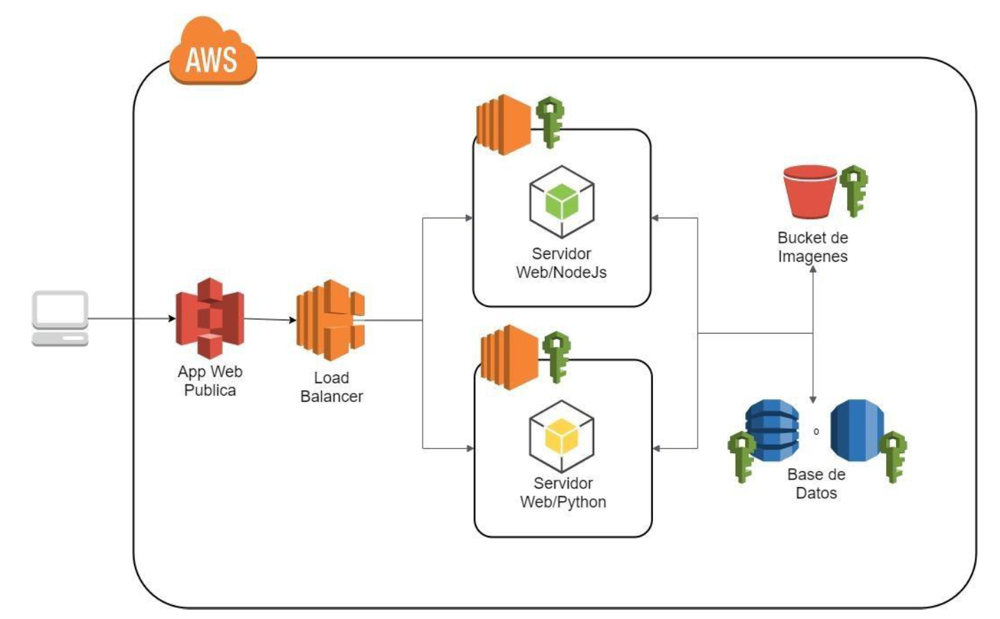
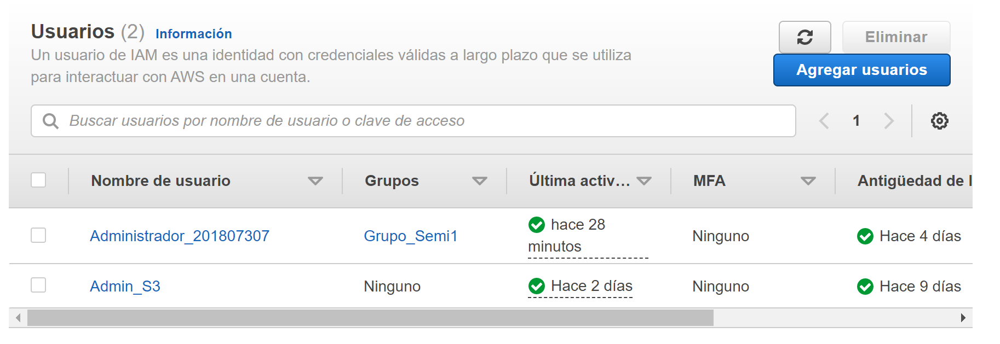
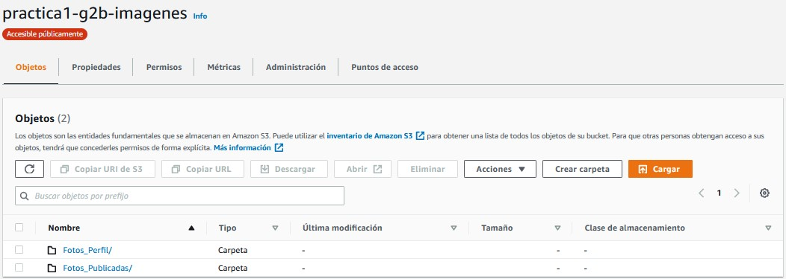
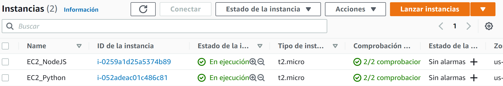
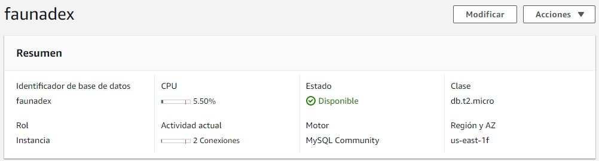
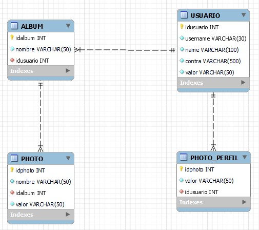
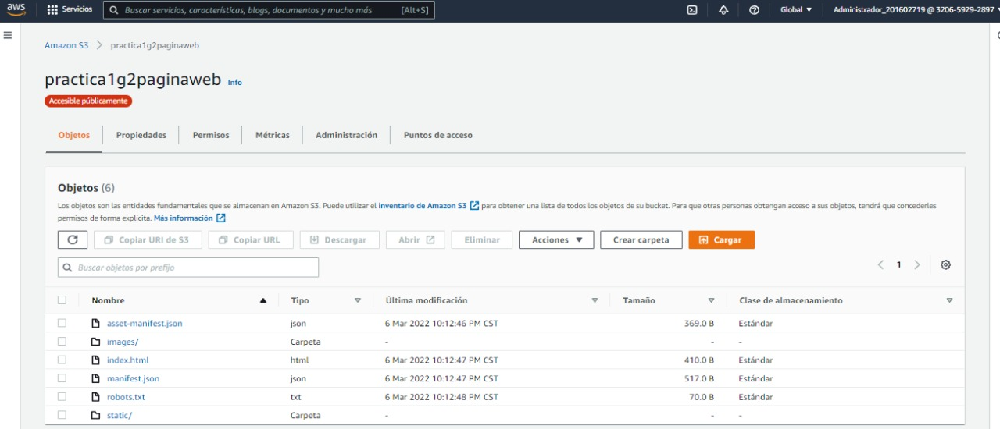

# **SEMINARIO DE SISTEMAS 1 GRUPO2**

Repositorio para la Práctica 1 del curso Seminario de sistemas 1

# **PRÁCTICA 1 - GRUPO 2**

Integrantes

201020614 -- Luis Fernando Jimenez Fernandez

201602719 -- Christofer William Borrayo López

201807307 -- Victor Alejandro Cuches de León

201700532 -- Milton Josue Antonio Villeda Gomez

**Arquitectura**

Para el desarrollo de la práctica se diseño una arquitectura AWS completamente en la nube
Compuesta por
* Un sitio web alojado en Amazon S3
* Un balanceador configurado en balanceadores carga de EC2
* Dos servidores alojados en dos instancias de EC2 para el backend 
  * Un servidor aloja una api REST desarrollada en nodejs
  * Un servidor aloja una api REST desarrollada en python
* Almacenamiento de información utilizando RDS y DBMS MySQL
* Almacenamiento de imagenes a través un bucket en Amazon S3

**Usuarios IAM**

Se creo un usuario Admin_S3 con permisos "AmazonS3FullAccess" para todo el manejo de S3
Se creo un usuario Administrador_201807307 con permisos "AdministratorAccess" para control y manejo de la cuenta para los miembros del grupo

**Buckets de S3**

Se creo el bucket para almacenar imagenes. Una carpeta para almacenar las fotos de perfil y otra carpeta para almacenar las fotos publicadas

**EC2*

Se crearon dos instancias de EC2 con sistema operativo ubuntu en las cuales fueron desplegadas las API Rest consumidas por el servicio.
Una contiene una API rest desarrollada en nodejs y otra API rest desarrollada en python

**Instancia RDS**

Se creo una instancia RDS para el manejo de base de datos utilizando MySQL

**Diagrama ER**

Diagrama entidad relación para el esquema de base de datos

**Aplicación web**

Se desarrollo un sitio web con el framework React js y se alojo en Amazon S3

